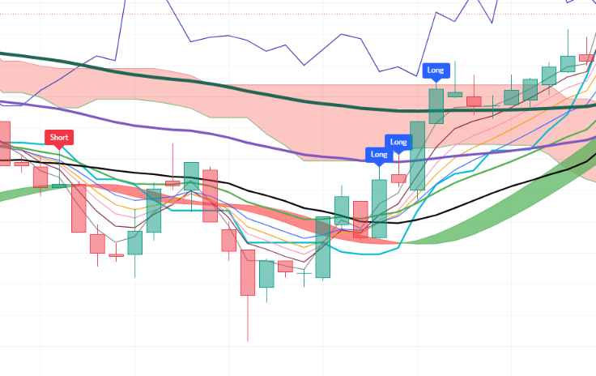

# Pine-Script-StochBased-Indicator
Indicator based on multi-timeframe EMA ribbons (1m, 3m, 9m), multi-timeframe RSI, Stochastic Momentum Index (SMI), Ichimoku Kinko Hyo, Hull Suite, and higher-timeframe session anchors with a modular "Use" toggle architecture. Signals entry for long/short across 1m, 3m, and 9m chart resolutions on TradingView.

--

## Chart Preview

--

## Motivation & Problem
- **False Breakouts in Low-Volume Chop**: Momentum crossovers from moving averages and RSI alone can trigger premature entries in tight ranges or false expansion phases without an oscillator confirming internal price position within the range.
- **The Core Goal**: To enhance the 1/3/9 multi-timeframe system by integrating a smoothed Stochastic Momentum Index (SMI) filter (+25 / -25 threshold bounds) alongside multi-timeframe EMA ribbons and RSI, filtering out low-conviction chop while retaining modular boolean switches.

--

## Strategy Logic & Architecture
- This indicator avoids false signals and wrong interpretation of the trend by utilizing a **rule-based, multi-factor filtering system**:
### Core Components:
1. **Multi-Timeframe EMA Ribbons & Hull Suite**:
  - Employs a 10-period EMA ribbon (lengths 3, 5, 7, 9, 12, 20, 30, 60, 100, 200) tracked across 1-minute, 3-minute, and 9-minute resolutions via 'request.security()'.
  - Detects key crossover triggers:
    - **3-Minute**: Fast EMAs (5, 7) crossing EMA 20, SMA 20, or EMA 60 ('EMACrossUp3' / 'EMACrossDown3').
    - **9-Minute**: Fast EMAs (5, 7) crossing EMA 20 or SMA 20 ('EMACrossUp9' / 'EMACrossDown9').
    - **1-Minute**: Fast EMA 5 crossing macro EMA 200 ('EMACrossUp1' / 'EMACrossDown1').
  - Features an integrated Hull Suite band (HMA 55, 240m HTF) for macro trend visualization and color grading.
2. **Smoothed Stochastic Momentum Index (SMI / Stoch)**:
  - Computes the double-smoothed Stochastic Momentum Index (%K Length 7, %D Length 3, Smoothing 3) on both 3-minute and 9-minute timeframes.
  - Generates directional boundary confirmations:
    - **Bullish Bias**: Smoothed SMI breaks above the +25 threshold line ('Min3StochLong', 'Min9StochLong').
    - **Bearish Bias**: Smoothed SMI breaks below the -25 threshold line ('Min3StochShort', 'Min9StochShort').
3. **Multi-Timeframe RSI & Modular "Use" Toggles**:
  - Gathers 3m and 9m RSI values across lengths 7, 9, 11, confirming momentum expansion above 55 (bullish) or below 45 (bearish).
  - Uses dynamic boolean toggles ('UseEMA1to10', 'UseRSI', 'UseMACD', 'UseIchimoku') via ternary bypass logic ('x ? y : true') to selectively activate or bypass individual technical components.
4. **Execution Rules by Timeframe**:
  - **1-Minute Chart Signals (IN1)**:
    - **Bullish Signal**: Triggers on 1m chart when 1m fast EMA crosses above EMA 200 (if enabled).
    - **Bearish Signal**: Triggers on 1m chart when 1m fast EMA crosses below EMA 200 (if enabled).
  - **3-Minute Chart Signals (IN3)**:
    - **Bullish Signal**: Triggers on 3m chart when 3m EMA crossover up occurs (if enabled) and 3m RSI is above 55 (if enabled) and 3m smoothed SMI is above +25.
    - **Bearish Signal**: Triggers on 3m chart when 3m EMA crossover down occurs (if enabled) and 3m RSI is below 45 (if enabled) and 3m smoothed SMI is below -25.
  - **9-Minute Chart Signals (IN9)**:
    - **Bullish Signal**: Triggers on 9m chart when 9m EMA crossover up occurs (if enabled) and 9m RSI is above 55 (if enabled) and 9m smoothed SMI is above +25.
    - **Bearish Signal**: Triggers on 9m chart when 9m EMA crossover down occurs (if enabled) and 9m RSI is below 45 (if enabled) and 9m smoothed SMI is below -25.
5. **Dynamic 1H & 1D Benchmark Anchors**:
  - Continuously projects real-time horizontal lines for 1-Hour ('open1H') and 1-Day ('open1D') opening prices with automatic previous-bar deletion ('line.delete(line1H[1])') to deliver clean, un-lagged session pivot references.

--

## Configurable Parameters
Users can adjust the following parameters inside TradingView's settings panel:
- **Time Frame Inputs**: Default - 1m, 2m, 3m, 9m. Configurable intervals for multi-timeframe calculations.
- **Stochastic Momentum Index (SMI)**: Default - %K Length 7, %D Length 3, EMA Signal Length 3, Smoothing Period 3, Threshold Levels (+25 / -25).
- **EMA Ribbon (Lengths 1-10)**: Default - 3, 5, 7, 9, 12, 20 (EMA & SMA), 30, 60, 100, 200. Toggle switches for signal crossover evaluation ('UseEMA1to10'), global ribbon visualization ('PlotEMA1to10'), and EMA 30 plotting.
- **RSI Time Frames & Lengths**: Default - 3m and 9m timeframes, lengths 7, 9, 11. Overbought/oversold thresholds (55 / 45) with 'UseRSI' toggle.
- **Ichimoku Kinko Hyo**: Default - Conversion Line 9, Base Line 26, Leading Span B 52, Displacement 26. Toggles for visual plotting ('PlotIchimoku') and directional slope filtering ('UseIchimoku').
- **Hull Suite**: Default - HMA length 55, 240m HTF. Customizable modes (HMA, EHMA, THMA), band transparency, and line thickness.
- **Time Mark (1H & 1D Anchors)**: Customizable line colors and widths for real-time 1-hour and 1-day opening price horizontal levels.

--

## How to Install & Use in TradingView
1. Open any crypto chart (e.g., `BTC/USDT`) on **[TradingView](https://www.tradingview.com/)**.
2. Open the **`Pine Editor`** console at the bottom of the page.
3. Open `1-3-9-StochBased.txt` (or your Pine Script file), copy the source code, and paste it into the editor.
4. Click **`Save`** and then click **`Add to Chart`**.
5. Switch chart timeframes to **`1m`**, **`3m`**, or **`9m`** and click the gear icon (`Settings`) on the indicator to adjust parameters as needed.

--

## Key Learnings & Engineering Reflections
1. **SMI Threshold Filtering for Momentum Quality (+25 / -25)**
  - I learned that combining the Stochastic Momentum Index (SMI) with moving average crossovers filters out low-velocity whipsaws. Requiring SMI to exceed +25 (or drop below -25) ensures price is not only crossing an EMA but is also printing high relative close-to-range velocity.
2. **Differentiated Crossover Rules per Timeframe Resolution**
  - I learned that different resolutions require tailored crossover logic: using micro fast-EMA crossovers against EMA/SMA 20 and EMA 60 on the 3m chart captures intermediate trend swings, while a fast EMA crossing EMA 200 on the 1m chart captures macro breakout acceleration.
3. **Modular Filter Control Using the Ternary Operator (x ? y : true)**
  - I learned that using the ternary operator (x ? y : true) allows effortless toggling of individual conditions. If x (Use toggle) is true, the script evaluates y (the filter condition); if x is false, it returns true as a pass-through bypass. This preserves compound boolean logic while giving traders full control over which sub-filters remain active.
